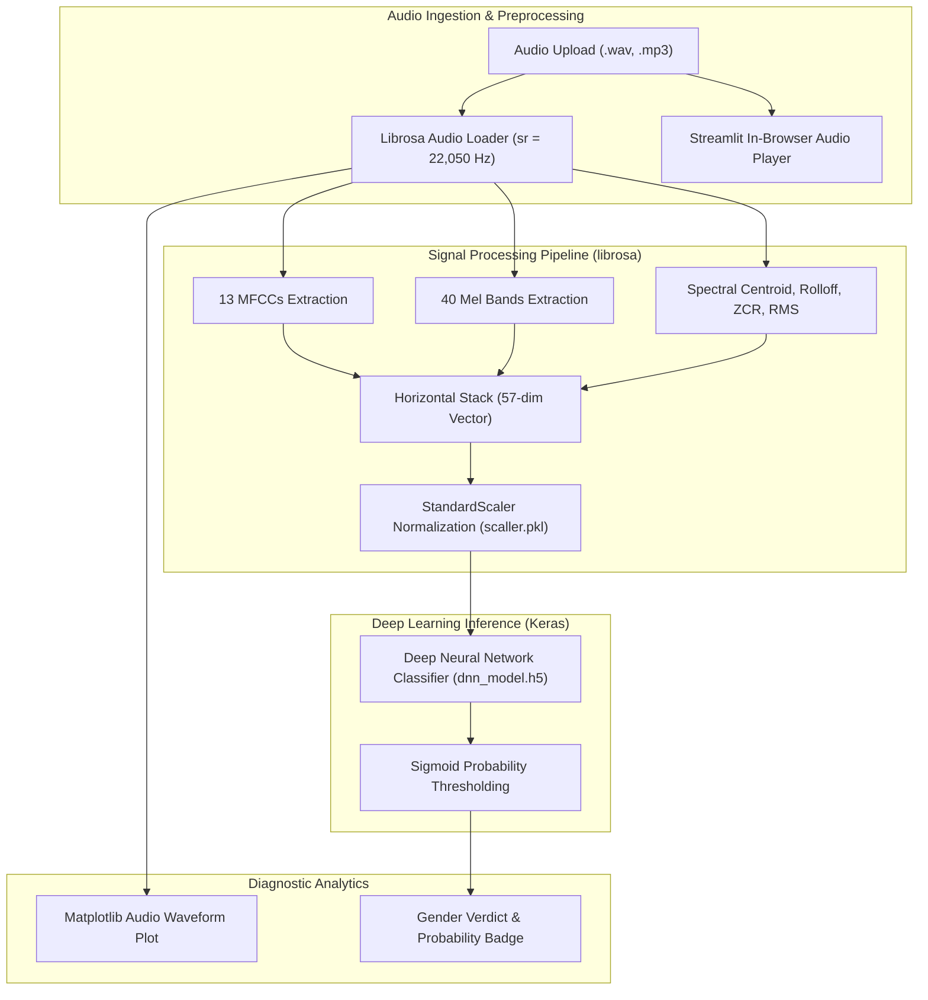

<br/><br/>

<!-- Animated Title -->
<p align="center">
  <a href="#">
    
  </a>
</p>

<p align="center">
  <b>Deep Learning Acoustic Signal Processing Engine for Voice Gender Classification</b><br/>
  <i>Librosa Feature Extraction · Multi-Tier Spectral Profiling (MFCC, Mel, Centroid, ZCR) · Keras Deep Neural Network · Interactive Audio Waveform & Spectrogram Studio</i>
</p>

<br/>

<!-- Badges Row 1: Core Technologies -->
<p align="center">
  
  
  
  
  
</p>

<!-- Badges Row 2: Acoustic Features & Status -->
<p align="center">
  
  
  
  
</p>

<br/>

<!-- Quick Navigation Bar -->
<p align="center">
  <a href="#-overview"></a>
  &nbsp;
  <a href="#-problem-statement--audio-solution"></a>
  &nbsp;
  <a href="#-acoustic-feature-pipeline"></a>
  &nbsp;
  <a href="#%EF%B8%8F-system-architecture"></a>
  &nbsp;
  <a href="#-deep-neural-network-topology"></a>
  &nbsp;
  <a href="#-quickstart--execution"></a>
</p>

---

## 📌 Overview

**Audio Model Classification Gender** is an end-to-end acoustic signal processing and deep learning system engineered to classify speaker gender from raw voice recordings. By translating raw time-domain audio waveforms into multi-dimensional spectral acoustic feature spaces, the platform extracts fundamental frequency harmonics, vocal tract resonances, and spectral energy envelopes.

The architecture pairs a **Librosa acoustic feature extractor** with a **Deep Neural Network (DNN)** trained in Keras (`dnn_model.h5`), standardized via Scikit-Learn (`scaller.pkl`), and packaged inside an interactive **Streamlit Studio** providing real-time audio playback, waveform oscilloscope plots, and instant gender classification.

```
                     ┌────────────────────────────────────────────────────────┐
                     │              Acoustic DNN Engine                       │
                     │                                                        │
[ Audio File: WAV / ]┼──> [ Librosa Resampling (22,050 Hz) ]                  ├──> [ Classification Report ]
[ MP3 Upload        ]│             │                                          │    - ♂️ Male / ♀️ Female Verdict
                     │             ▼                                          │    - Confidence Score (%)
                     │    [ Multi-Feature Vectorizer (57 Dimensions) ]        │    - Waveform Oscilloscope
                     │       ├── 13 MFCCs + 40 Mel Spectrograms               │    - Mel-Spectrogram Heatmap
                     │       └── Spectral Centroid, Rolloff, ZCR, RMS         │
                     │             │                                          │
                     │             ▼                                          │
                     │    [ StandardScaler ] ──> [ Deep Neural Net (DNN) ]    │
                     └────────────────────────────────────────────────────────┘
```

---

## 🎯 Problem Statement & Audio Solution

<table>
<tr>
<td width="50%" valign="top">

### ❌ The Acoustic Voice Challenge

Classifying speaker characteristics from unconstrained audio faces several hurdles:

- 🌊 **Background Noise & Clipping**: Real-world voice clips contain room reverberation, varying microphone gains, and ambient noise.
- ⏱️ **Variable Clip Lengths**: Direct time-domain modeling fails when recordings range from 1 second to several minutes.
- 🎚️ **Pitch Overlap**: Pitch alone cannot reliably distinguish gender due to overlapping vocal ranges (e.g. adolescent male vs. female speakers).

</td>
<td width="50%" valign="top">

### ✅ The Signal Processing Solution

| Challenge | Applied Engineering Solution |
| :--- | :--- |
| **Spectral Invariance** | Extracts **13 MFCCs** and **40 Mel-filterbank bands**, mimicking human cochlear frequency perception. |
| **Timbre & Texture** | Combines **Spectral Centroid** (brightness), **Spectral Rolloff** (high-frequency energy), and **ZCR** (noisiness). |
| **Duration Invariance** | Averages time-step frames across the temporal axis to produce a fixed **57-dimensional feature vector**. |
| **Deep Non-Linearity** | **Keras Multi-Layer DNN** captures non-linear acoustic interactions beyond simple pitch thresholds. |

</td>
</tr>
</table>

---

## 🔥 Acoustic Feature Pipeline

The system extracts a concatenated **57-dimensional feature representation** per audio sample:

| Feature Dimension | Quantity | Acoustic Characteristic Captured |
| :--- | :---: | :--- |
| **MFCC Means** | **13** | Spectral envelope and vocal tract vocalization shape |
| **Mel Spectrogram Means** | **40** | Non-linear psychoacoustic pitch and power distribution |
| **Spectral Centroid** | **1** | "Center of mass" of sound; correlates with vocal brightness |
| **Spectral Rolloff** | **1** | Frequency below which 85% of spectral energy concentrates |
| **Zero Crossing Rate (ZCR)** | **1** | Rate of sign-changes; differentiates voiced from unvoiced consonants |
| **Root Mean Square (RMS)** | **1** | Global acoustic energy and signal intensity |

---

## 🏗️ System Architecture



---

## ⚙️ Technical Stack

| Component | Technology | Purpose & Implementation |
| :--- | :--- | :--- |
| **Deep Learning** | **TensorFlow & Keras** | Sequential Deep Neural Network architecture (`dnn_model.h5`) |
| **Acoustic Processing** | **Librosa** | Audio decoding, resampling, STFT, MFCCs, and spectral analysis |
| **Feature Scaling** | **Scikit-Learn** | StandardScaler fit to training distribution (`scaller.pkl`) |
| **Interactive UI** | **Streamlit** | Low-latency dashboard with audio upload and waveform rendering |
| **Acoustic Plotting** | **Matplotlib** | Real-time oscillogram and waveform visualization |

---

## 📁 Repository Structure

```
Audio-Model-Classification-Gender/
├── 📄 dnn_app.py                       # Interactive Streamlit audio classification application
├── 📄 audio-classification-gender.ipynb # Training, feature engineering & model validation notebook
├── 📄 dnn_model.h5                     # Serialized Keras Deep Neural Network model
├── 📄 scaller.pkl                      # Serialized StandardScaler for 57 acoustic features
├── 📄 requirements.txt                 # Dependencies
├── 📁 .devcontainer/                   # Development container configuration
└── 📄 README.md                        # Documentation
```

---

## 🚀 Quickstart & Execution

### Prerequisites
- **Python**: 3.10 or higher
- **FFmpeg**: Recommended for universal audio format decoding (`mp3`, `flac`)

---

### 1. Installation

```bash
# 1. Clone repository
git clone https://github.com/IbrahimAbdelsattar/Audio-Model-Classification-Gender.git
cd Audio-Model-Classification-Gender

# 2. Create virtual environment
python -m venv venv
source venv/bin/activate        # On Windows: .\venv\Scripts\activate

# 3. Install dependencies
pip install -r requirements.txt
pip install streamlit tensorflow librosa scikit-learn matplotlib numpy joblib
```

---

### 2. Running the Audio Classifier

```bash
streamlit run dnn_app.py
```

*The web application will open at `http://localhost:8501`. Upload any `.wav` or `.mp3` voice clip to visualize the waveform and generate predictions.*

---

## 👥 Author & Connect

**Ibrahim Abdelsattar**  
*AI Engineer & Machine Learning Specialist*

- 🌐 **GitHub**: [@IbrahimAbdelsattar](https://github.com/IbrahimAbdelsattar)
- 💼 **LinkedIn**: [Ibrahim Abdelsattar](https://www.linkedin.com/in/ibrahim-abdelsattar/)
- 📧 **Email**: [ibrahimabdelsattar042@gmail.com](mailto:ibrahimabdelsattar042@gmail.com)

---

<p align="center">
  <sub>Engineered for acoustic machine learning, voice analytics, and digital signal processing. © 2026 Audio Gender Classification.</sub>
</p>
