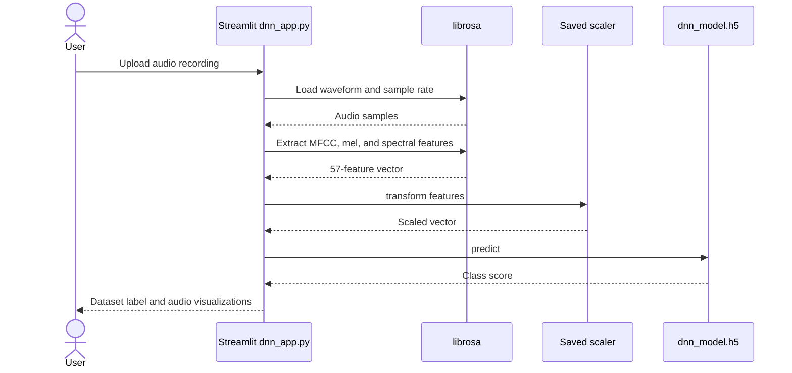

# Audio Gender Classification

An audio classification experiment with a Streamlit demo that extracts acoustic features and predicts the binary labels used by its training data.

**Technology:** Python · librosa · TensorFlow/Keras · scikit-learn · Streamlit

## Features

- Upload WAV, MP3, or OGG recordings for inference.
- Extract 13 MFCC means, 40 mel-band means, spectral centroid, rolloff, zero-crossing rate, and RMS: 57 features per recording.
- Scale features with the saved preprocessing artifact and run the DNN.
- Display the uploaded audio and acoustic visualizations; compare SVM, XGBoost, and neural experiments in the notebook.

## Repository guide

| Path | Purpose |
|---|---|
| [dnn_app.py](dnn_app.py) | Feature extraction and Streamlit inference. |
| [audio-classification-gender.ipynb](audio-classification-gender.ipynb) | Dataset preparation and model experiments. |
| [dnn_model.h5](dnn_model.h5) | Saved neural network. |
| [scaller.pkl](scaller.pkl) | Saved scaler; filename spelling is required by the app. |
| [requirements.txt](requirements.txt) | Application dependencies. |

## Requirements and current limitations

Run from the repository root so `dnn_model.h5` and `scaller.pkl` resolve correctly. Keep the feature order and preprocessing consistent with training. The binary output represents dataset labels inferred from audio; it does not establish a speaker's gender identity. Training data and notebook-specific packages must be supplied separately where referenced. The committed runtime manifest omits scikit-learn/joblib dependencies needed by the saved preprocessing or model artifacts; the supplemental install command supplies them.

## UML diagrams

### Main workflow

The application extracts the same 57 audio features before scaling and DNN inference.



## Getting started

```bash
git clone https://github.com/IbrahimAbdelsattar/Audio-Model-Classification-Gender.git
cd Audio-Model-Classification-Gender
```

Use a Python virtual environment:

```bash
python -m venv .venv
```

Activate it with `source .venv/bin/activate` on macOS/Linux or `.venv\Scripts\Activate.ps1` in PowerShell.

```bash
python -m pip install -r requirements.txt
python -m pip install scikit-learn joblib
python -m streamlit run dnn_app.py
```
